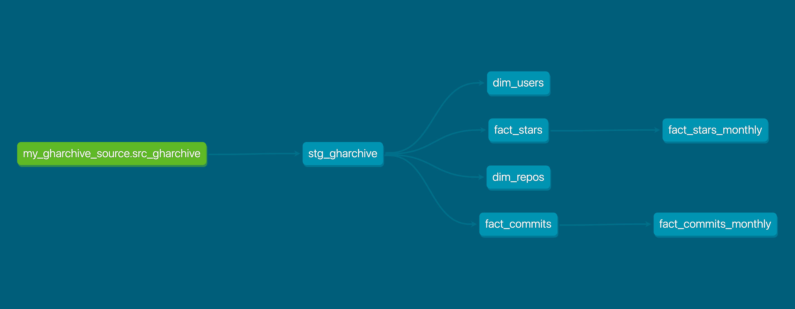
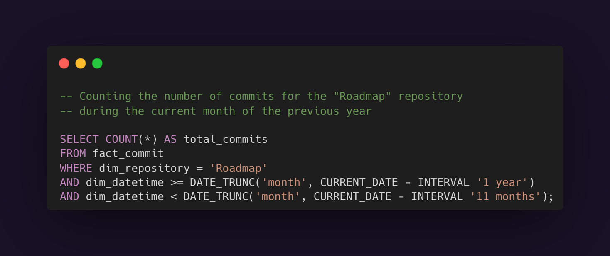
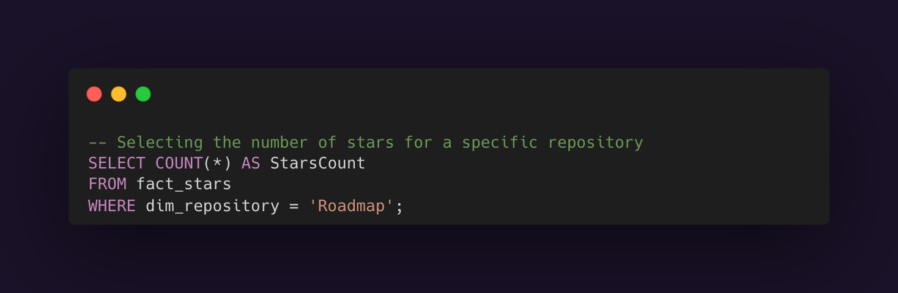

# GitHub Gems: Driving Open-Source Investments With Data

## Table of contents
* [Overview](#Overview)
* [Important metrics](#Important-metrics)
* [Data source](#data-source)
* [Models](#Models)

## Overview
Our goal is to develop an efficient data pipeline that streamlines analytics, reduces manual effort, and enables deeper insights into the open-source ecosystem on GitHub. By leveraging modern data tools and best practices, such as dbt (data build tool) and Airflow, we aim to create a scalable and reliable solution for data-driven decision-making.

## Lineage Graph

## Important metrics
To optimize our pipeline, we are extracting. These metrics offer a detailed and measurable overview of an open-source project's health, growth potential, and overall performance. By analyzing these metrics, we can make informed decisions on resource allocation to maximize impact and efficiency.

### Github Stars and Forks
Github stars are important metrics that provide us an idea of how many people have saved a particular repository.
GitHub forks are valuable indicators that show us how many people have copied a particular repository to work on independently.

### Contributors 
GitHub contributors are key figures that tell us how many people have actively participated in developing a particular repository.

### Pull Requests 
Both open and merged pull requests provide insight into how the project handles incoming contributions and its openness to community involvement.

### Commit Frequency 
Measures how active the project is. Frequent commits typically indicate ongoing development and maintenance.

### Visitors
GitHub visitors are important metrics that indicate how many people have viewed a particular repository, offering insights into its popularity and reach.

### Git Clones
Git clones are essential metrics that show how many times a repository has been duplicated, indicating its influence and reach within the developer community.

### Package Downloads
Package downloads are significant metrics that reflect the number of times a software package has been downloaded, demonstrating its usage and popularity.

Here are some SQL queries for most common use cases

## Data source
For the source of data we have a few options, but we are more interest in two of them, GitHub API and GH Archive. 
Lets discuss the difference between them, the pros and cons.

### Advantages of the Github API
* Most recent fresh data
* Speed and performance
* Data accuracy
* Not a third party 

### Disatvantages of the Github API
* Primary rate limit for requests (5000 requests per hour for authorized users and 15000 requests per hour for enterprise users)
* Complex load logic
* Not primarily focused on archived data

### Advantages of GH Archive
* Offers a comprehensive, historical log of GitHub events dating back to 2011.
* Free to use and easily accessible for downloading historical GitHub event data.
* Provides access to a massive amount of data because it records all public GitHub events.

### Disatvantages of GH Archive
* Third party source
* Can have slower speed compared to Github API
* No real time data

GH Archive is an invaluable resource for historical data analysis and large-scale trend observations on GitHub projects. However, its use involves significant data handling, processing demands, and potential costs, making it less suitable for real-time applications, small-scale needs, or users without substantial data processing capabilities. For tasks requiring real-time data or targeted queries, the GitHub API may be a more appropriate choice.
In our case, it would be the best to work with GH Arhcive, simply because there are no request limitations. 

Deliverable data format is in structured data tables. These tables will be optimized for querying using SQL, allowing for easier access and analysis. The data is updated daily to ensure we have the most current and relevant information available.

## Models
We are utilizing the Kimball methodology for data warehousing, which focuses on building a dimensional model to enhance analytics efficiency and scalability. For this, we are gathering possible list of facts and dimensions.

### List of facts and dimesnions
* **Fact**: Stars - **Dimensions**: dim_user, dim_repository, dim_datetime
* **Fact**: Commits - **Dimensions**: dim_user, dim_repository, dim_branch, dim_datetime
* **Fact**: Forks - **Dimensions**: dim_user, dim_repository, dim_datetime
* **Fact**: Pull requests - **Dimensions**: dim_user, dim_repository, dim_reviewer, dim_datetime
* **Fact**: Git clones - **Dimensions**: dim_user, dim_repository, dim_source, dim_datetime